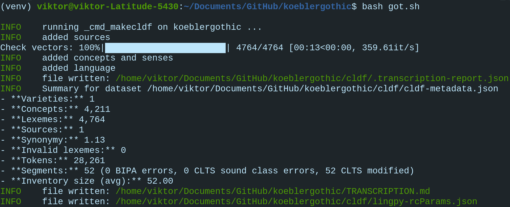

Part 1: Create CLDF
===================

The following six steps will guide you through the process of
converting raw language data to CLDF. Each step can be found in the
`continuous integration workflow
<https://app.circleci.com/pipelines/github/LoanpyDataHub/koeblergothic>`_
as well. The data we are converting comes from
the `Gothic Dictionary
<https://www.koeblergerhard.de/got/got.html>`_ (Köbler 2014),
which contains Gothic words as headwords, together with their
meaning and a list of sources that have dealt with analysing them.
`Gothic <https://glottolog.org/resource/languoid/id/goth1244>`_ belongs to the
Eastern branch of Germanic, which belongs to the
Indo-European language family. The main data source for Gothic is a
1600 year old bible translation that was rediscovered 354 years ago and has
lead to extensive analyses and the creation of multiple dictionaries ever
since (for example `Streitberg (1910), available
as CLDF <https://github.com/martino-vic/streitberggothic>`_, or `Lehmann
(1986) <https://archive.org/details/lehmann-gothic-etymological-dictionary-1986/mode/2up>`_).
The raw data in this repository contains
only a small fraction of the contents of the dictionary.
If you are passionate about Gothic and want to improve this data
set, check out our `contribution guidelines
<https://github.com/martino-vic/koeblergothic/blob/main/CONTRIBUTING.md>`_
and let's get in touch!

Step 1: Activate virtual environment and clone the repository
-------------------------------------------------------------

.. code-block:: sh

   python3 -m venv venv && source venv/bin/activate
   git clone https://github.com/martino-vic/koeblergothic.git

Deactivate the virtual environment by running

.. code-block:: sh

   deactivate

See `Part1, Step 1 in gerstnerhungarian
<https://gerstnerhungarian.readthedocs.io/en/latest/mkcldf.html#part-1-create-cldf>`_
for more details.

Step 2: Clone reference catalogues and loanpy
---------------------------------------------

See `Part1, Step 2 in gerstnerhungarian
<https://gerstnerhungarian.readthedocs.io/en/latest/mkcldf.html#step-2-clone-reference-catalogues-and-loanpy>`_.

Step 3: Install commands, download wordvectors, create orthographic profile
---------------------------------------------------------------------------

Install necessary dependencies in development mode with the ``-e`` flag:

.. code-block:: sh

   pip install -e koeblergothic
   pip install -e loanpy

Install 500MB word-vector model:

.. code-block:: sh

   python3 -m spacy download de_core_news_lg

See `Part1, Step 3 in gerstnerhungarian
<https://gerstnerhungarian.readthedocs.io/en/latest/mkcldf.html#step-3-install-commands-download-wordvectors-create-orthographic-profile>`_
for more details.

Step 4: Some preparations
-------------------------

``raw/gothic.txt`` is a raw text file that was directly copied from the
original online-dictionary. It has to be parsed and its relevant parts turned
into tabular data. This is done by running following command:

.. code-block:: sh

   cldfbench koeblergothic.txt2tsv

The output is ``raw/gothic.tsv``, which will serve as the main input file
for the conversion.

.. automodule:: koeblergothiccommands.txt2tsv
   :members:

Next, the file ``etc/concepts.tsv`` has to be created with the help of the
`pysem <https://pypi.org/project/pysem/>`_ library. ``etc/concepts.tsv``
serves as basis to create ``cldf/parameters.csv`` during the conversion,
a table that contains references to entries in `Concepticon
<https://concepticon.clld.org/>`_. Create it by running:

.. code-block:: sh

   cldfbench koeblergothic.map2concepts

.. automodule:: koeblergothiccommands.map2concepts
   :members:

Lastly, we are creating orthographic profiles with the help of the
`epitran <https://pypi.org/project/epitran/>`_ library and lingpy's
`ipa2tokens
<https://lingpy.readthedocs.io/en/latest/reference/lingpy.sequence.html#lingpy.sequence.sound_classes.ipa2tokens>`_
function. The resulting file, ``etc/orthography.tsv`` will be the basis for
creating the column ``Segment`` in ``cldf/forms.csv``, which contains
tokenised IPA transcriptions of words. This command takes ``cldf/forms.csv``
as input and can therefore be only run once the lexibank_script was exectuted
successfully. This can sometimes mean that you have to comment out certain
parts of the lexibank-script to make it run, then create the correct
orthographic profiles, then uncomment and rerun the lexibank script
(especially when there are BIPA transcription errors, it means your
orthographic profiles are not up to date).

Create orthographic profiles by running:

.. code-block:: sh

   cldfbench koeblergothic.makeortho

.. automodule:: koeblergothiccommands.makeortho
   :members:

Step 5: Run lexibank script
---------------------------

This script combines files from the raw and etc folders and populates the
folder ``cldf``:

.. code-block:: sh

   cldfbench lexibank.makecldf cldfbench_koeblergothic.py  --concepticon-version=v3.1.0 --glottolog-version=v4.7 --clts-version=v2.2.0 --concepticon=../concepticon/concepticon-data --glottolog=../glottolog --clts=../clts
   cldfbench koeblergothic.update_readme

For a detailed explanation of what this script does, read the the tutorial at
https://calc.hypotheses.org/3318 and `Part1, Step 4 in gerstnerhungarian
<https://gerstnerhungarian.readthedocs.io/en/latest/mkcldf.html#step-4-run-lexibank-script>`_.

The below description will only cover differences that weren't discussed
in the earlier tutorials yet:

.. code-block:: python

   import csv

This inbuilt library will be used to write the table ``cldf/adapt.csv``
containing predicted loanword adaptations with short primary and foreign
keys to save disc space.

.. code-block:: python

   ad = Adrc("etc/WOT2EAHsc.json", "etc/invsEAH.json")
   HOWMANY = 100

The file ``etc/WOT2EAHsc.json`` is the sound correspondence file for
predicting loanword adaptations into Early Ancient Hungarian, and
``etc/invsEAH.json`` is the phonotactic inventory file.
We have generated these in `Part 3, steps 1-3 of the ronataswestoldturkic
repository
<https://ronataswestoldturkic.readthedocs.io/en/latest/mkloanpy.html#step-3-mine-vertical-and-horizontal-sound-correspondences>`_
and create an instance of the Adrc-object now based on that
information.
The files itself have been directly copied from the
``ronataswestoldturkic/loanpy`` folder.

With ``HOWMANY=100`` we specify that we want 100 loanword adaptation
predictions per input word.

.. code-block:: python

   def trim(word):
       if word == "an":
           return word
       return re.sub("an$", "", word)

Here we trim the sequence "an" from the end of Gothic words, since this
is a suffix that marks the infinitive.

.. code-block:: python

   @attr.s
   class CustomLexeme(Lexeme):
       ProsodicStructure = attr.ib(default=None)

Here we are defining a custom column called ``ProsodicStructure`` in
``cldf/forms.csv``. It will contain the phonotactic structures of
headwords, like "CVCV", for example.

.. code-block:: python

   args.writer.cldf.add_component(
       "SenseTable",
       {"name": "Spacy", "datatype": "string"},
       {"name": "Form_ID", "datatype": "string"}
   )

Here we are creating a new table that will be called ``cldf/senses.csv`` (see
`SenseTable <https://github.com/cldf/cldf/tree/master/components/senses>`_
and the `list of available table types
<https://github.com/cldf/cldf/tree/master/components>`_).
The column ``Meaning`` in ``raw/gothic.tsv`` contains multiple
English translations separated by a comma and a space. This is an
array-like data-structure,
which in relational databases should be avoided. With the sense-table,
we are therefore giving each translation in the list of meanings an own row
and a foreign key that points to the corresponding row in ``cldf/forms.csv``.

.. code-block:: python

   args.writer.add_sources()
   args.log.info("added sources")

Here we are adding the sources from the
`BibTex <https://de.wikipedia.org/wiki/BibTeX>`_ file ``raw/sources.bib`` to
the ``cldf`` folder and print a message to the console after this step
was successful.

.. code-block:: python

   concepts = {}
   for i, concept in enumerate(tqdm(self.concepts, "Check vectors")):
       idx = str(i)+"_"+slug(concept["Sense"])
       concepts[concept["Sense"]] = idx
       args.writer.add_concept(
               ID=idx,
               Name=concept["Sense"],
               Concepticon_ID=concept["Concepticon_ID"],
               Concepticon_Gloss=concept["Concepticon_Gloss"],
               )

Here we are creating the file ``cldf/parameters.csv``, which will hold
references to concepts in `Concepticon <https://concepticon.clld.org/>`_.
The ``self.concepts`` part reads the file ``etc/concepts.tsv``, which
was created with the `pysem <https://pypi.org/project/pysem/>`_ library
during the previous step. The tqdm-library prints
a progressbar to the console.

.. code-block:: python

   for j, sense_desc in enumerate(concept["Sense"].split(", ")):
       vector = filter_vectors(sense_desc)
       args.writer.objects["SenseTable"].append({
           "ID": str(i) + "_" + slug(sense_desc) + "-" + str(j + 1),
           "Entry_ID": 0,
           "Description": sense_desc.strip(),
           "Spacy": vector,
           "Parameter_ID": idx
           })

   args.log.info("added concepts and senses")

Within the previous loop, that goes through the rows of ``etc/concepts.tsv``
one by one, we start a second loop. It goes through the different
translations that originate from the column ``Meaning`` in
``raw/gothic.tsv``. It puts each translation into an own row of
``cldf/senses.tsv`` and provides a foreign key in column ``Parameter_ID``.
This foreign key points to the primary key in ``parameters.csv`` and to the
foreign keys in ``Parameter_ID`` in ``cldf/forms.csv``. The column
``Entry_ID`` is a default column and must be populated even if it is not
pointing anywhere. Therefore, it contains only zeroes.

.. code-block:: python

   languages = args.writer.add_languages()
   args.log.info("added languages")

   data = self.raw_dir.read_csv(
       "gothic.tsv", delimiter="\t",
   )
   header = data[0]
   cognates = {}
   cogidx = 1

Here, we are reading the file ``etc/languages.tsv``, writing it to
``cldf/languages.tsv`` without modification, and print a message to
the console upon success. Then, we read ``raw/gothic.tsv``, define the
header and instantiate some variables that we will need later during this
script.

.. code-block:: python

   with open("cldf/adapt.csv", "w+") as f:
       writer = csv.writer(f)
       writer.writerow(["ID", "Form_ID", f"ad{HOWMANY}"])

Since the CLDF architecture doesn't allow for custom-tables, we have to
open one without the cldf-writer. This means that the file that we are
creating will not be included in ``cldf/metadata.json`` and hence will
be excluded when creating a database from metadata alone. The file we are
writing will contain predicted loanword adaptations of Gothic words into
Early Ancient Hungarian. Since we have multiple predictions that are
outputted as an array and since arrays should not be used as data-structures
in relational databases, we are creating this new table ``adapt.py``. We
are also writing the names of its three columns to the file. ``ID`` is the
primary key, ``Form_ID`` points to the rows in column ``Local_ID`` in
``cldf/forms.csv`` and ``ad{HOWMANY}`` contains as many of the most likely
predictions for loanword adaptation of each Gothic word, as we have defined
it in the static variable ``HOWMANY`` earlier.

.. code-block:: python

   for i in range(1, len(data)):
       for lex in args.writer.add_forms_from_value(
               Language_ID="Gothic",
               Parameter_ID=concepts[data[i][1]],
               Value=data[i][0],
               Source="Kobler1989",
               ):
           lex["ProsodicStructure"] = prosodic_string(lex["Segments"], _output='cv')

Here we are creating the file ``cldf/forms.csv`` by looping
through the rows of ``raw/gothic.tsv``. The columns ``Language_ID`` and
``Source`` are hard-coded since the repository is based on one single source
and only contains one single language. The column ``Parameter_ID`` contains
the foreign keys to ``cldf/parameters.csv``. The column ``Value`` is the
same as the column ``Gothic`` in ``raw/gothic.tsv``. The column
``ProsodicStructure`` has to be inserted through a loop, after the table
``cldf/forms.csv`` has already been created, since it is taking contents
from one of its columns, namely ``Segments`` as input. Its output are
phonotactic profiles such as "CVCV". These are created with lingpy's
`prosodic_string
<https://lingpyxrotwang.readthedocs.io/en/latest/reference/lingpy.sequence.html#lingpy.sequence.sound_classes.prosodic_string>`_
function.

.. code-block:: python

   for pred in ad.adapt(lex["Segments"], HOWMANY).split(", "):
       writer.writerow([f"a{adidx}", f"f{str(i)}", pred])
       adidx += 1

Here we are predicting loanword adaptation with loanpy, based on heuristics
and data extracted from the etymological dictionary "West Old Turkic"
in the repository `ronataswestoldturkic
<https://ronataswestoldturkic.readthedocs.io/en/latest/?badge=latest>`_. We
are making 100 predictions per word, this number was set to 100 earlier.
We write the references to
``cldf/adapt.csv`` and add a primary key and a foreign key to reference
rows in ``cldf/forms.csv``.

This is how your console should approximately look like after the conversion:

Now only two minor changes are missing before the CLDF conversion is finished.

Step 6: Post-processing
-----------------------

First, we need to change the IDs in ``cldf/forms.csv``, so they match the
ones in ``cldf/adapt.csv``. This cannot be done from within the
lexibank-script, which is why it is done during post-processing. The reason
why we have to use custom IDs in this case is that the default IDs are too
long and take up too much space. ``adapt.csv`` with default IDs takes up
26MB and with short IDs only 11MB. This makes a significant difference,
especially if we were to make more predictions than only 100 per word.
The IDs are replaced with this command:

.. code-block:: sh

   cldfbench koeblergothic.fixid

.. automodule:: koeblergothiccommands.fixid
  :members:

Secondly, the readme needs to be updated by adding information about
the version of Spacy and the vector coverage within it, as well as a bullet
that informs about the number of senses in ``cldf/senses.csv``, to which
the percentage in the vector-coverage-badge refers.

.. code-block:: sh

   cldfbench koeblergothic.update_readme

.. automodule:: koeblergothiccommands.update_readme
  :members:

Congratulations, the CLDF-conversion was successful!
